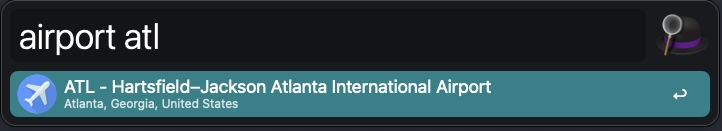

# Alfred Airport Code Lookup

---

Alfred workflow to look up the 3 letter IATA codes for airports around the world. Just use the `airport` keyword and up to 3 characters.

Currently just searches the IATA codes not the actual names of the airports.
